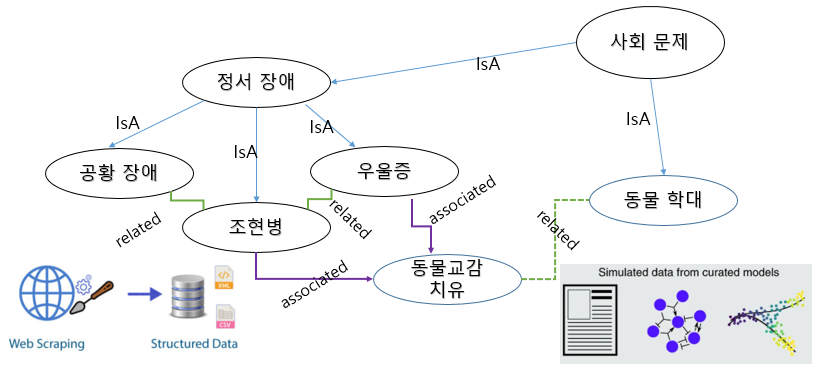

# Sentiment Analysis

**How different are sentiment and emotion?**

**Sentiment** is a general thought, feeling, or sense while **emotion** is a person's internal state of being and involuntary physiological response to an object or a situation, based on or tied to physical state and sensory data. So, then anlaysis of linguistic expressions of thought, feeling or sense are sentiment analysis rather than emotion analysis. 

**Sentiments** are social concepts which are represented in languages rather than personal concepts of emotions which would be represented in psychological symptoms.  

# Sentiment words in a Knowledge Graph

